# 样例
- 简单柱状图
  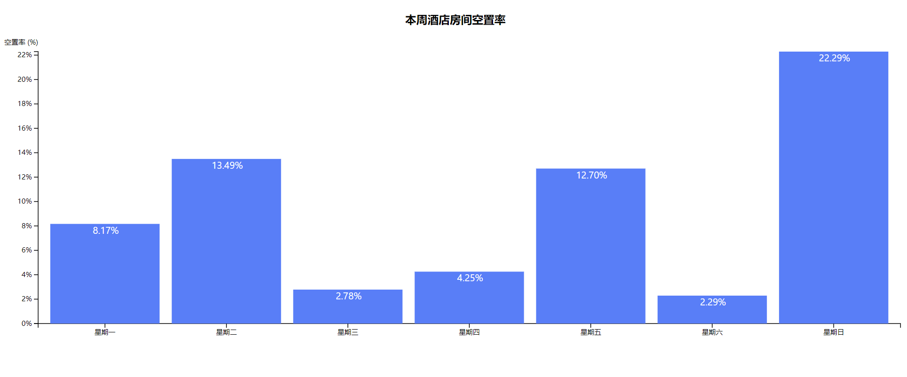
- 简单折线图
  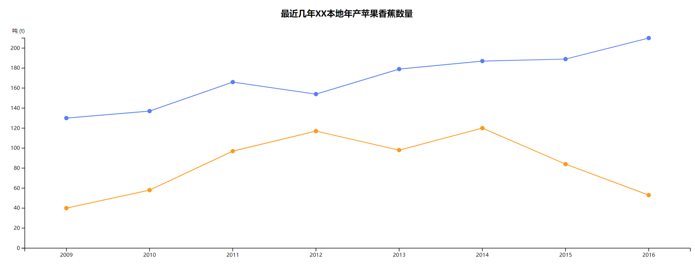
- 简单折线图 II
  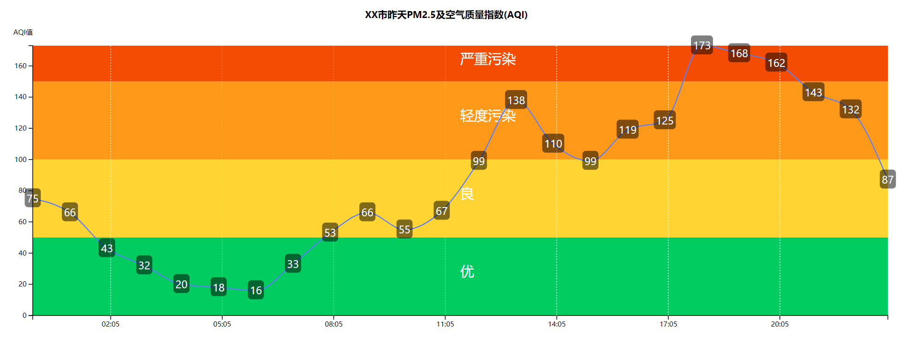
- 组合柱状图
  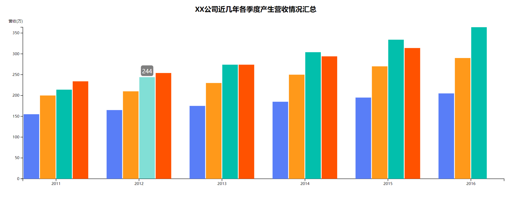
- 中国地图
  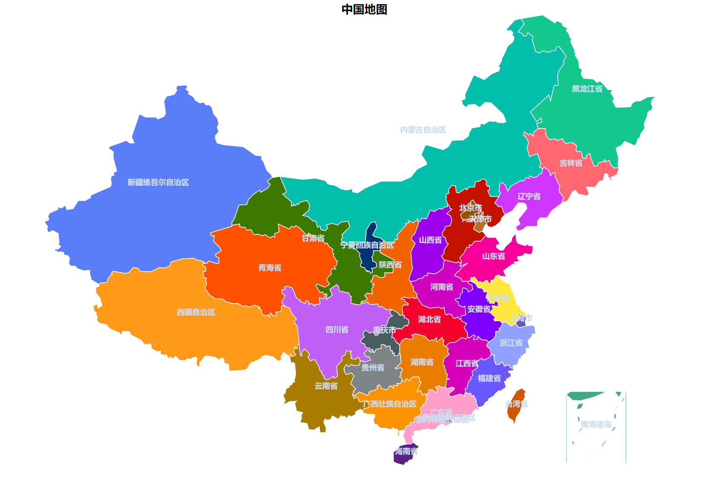
- 简单面积图
  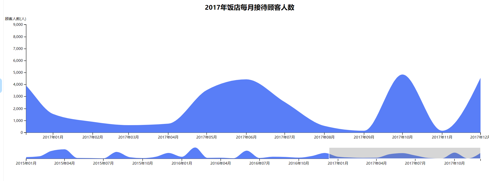
- 简单饼图
  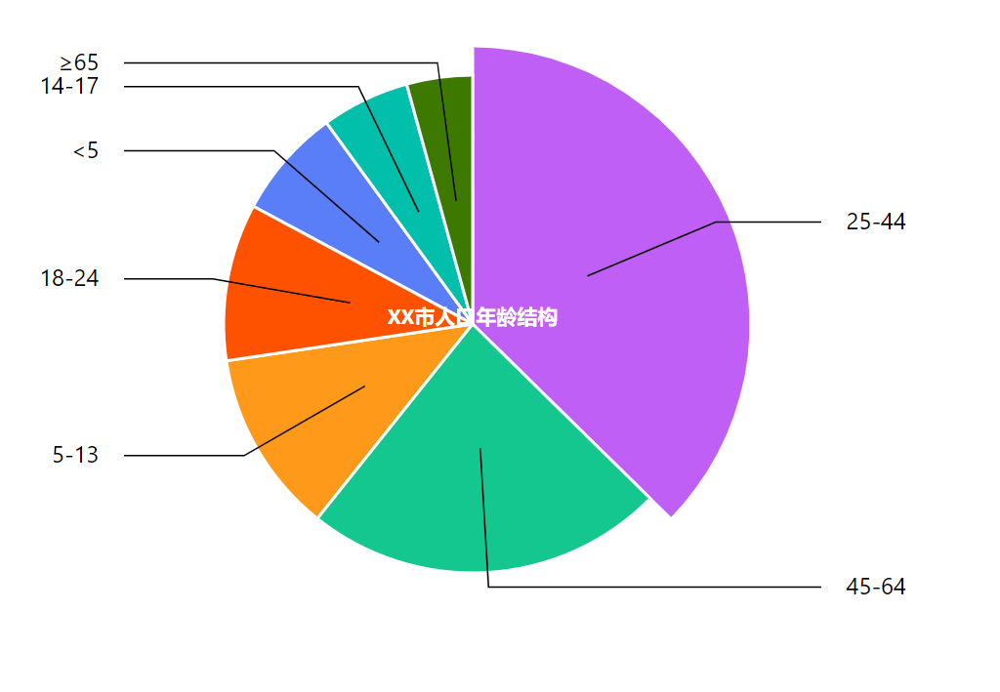
- 简单环图
  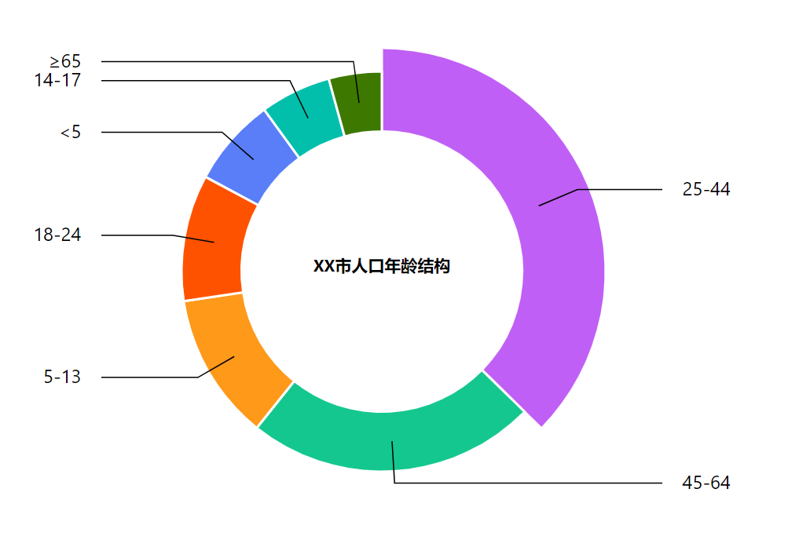
- 简单树图
  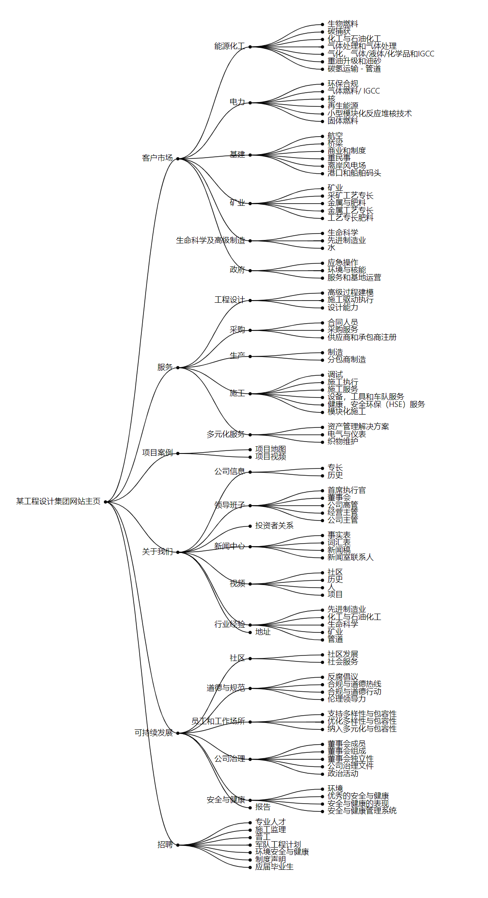
- 简单点图
  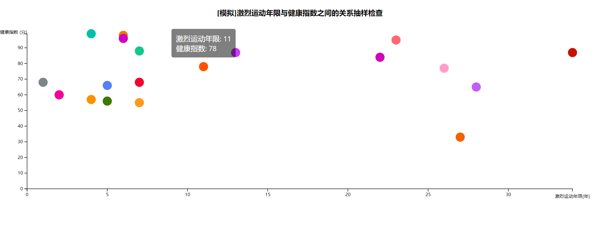
- 简单堆栈柱状图
  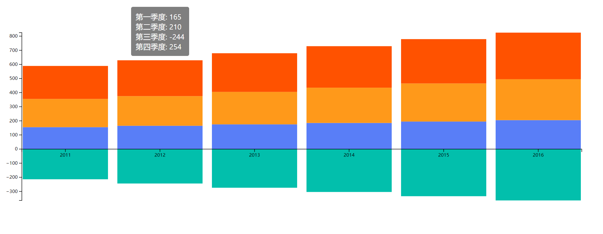
- 径向堆栈图
  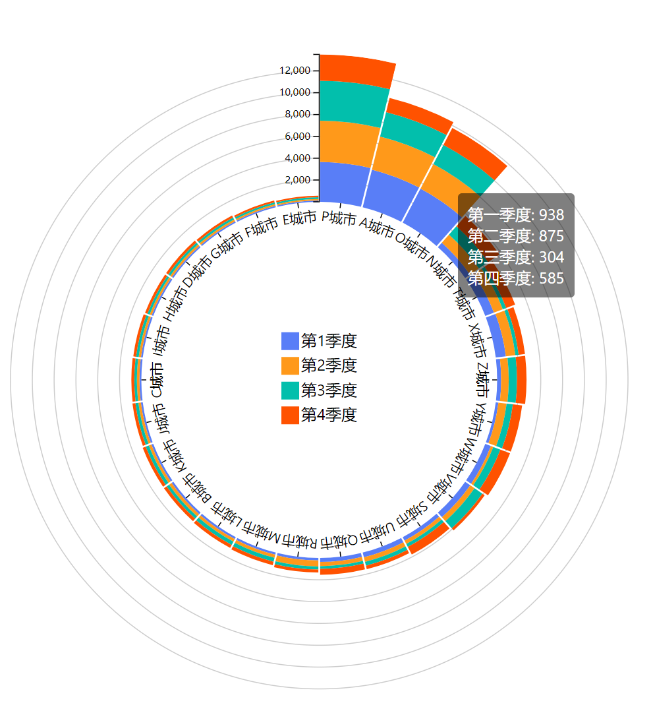
- 简单力图
  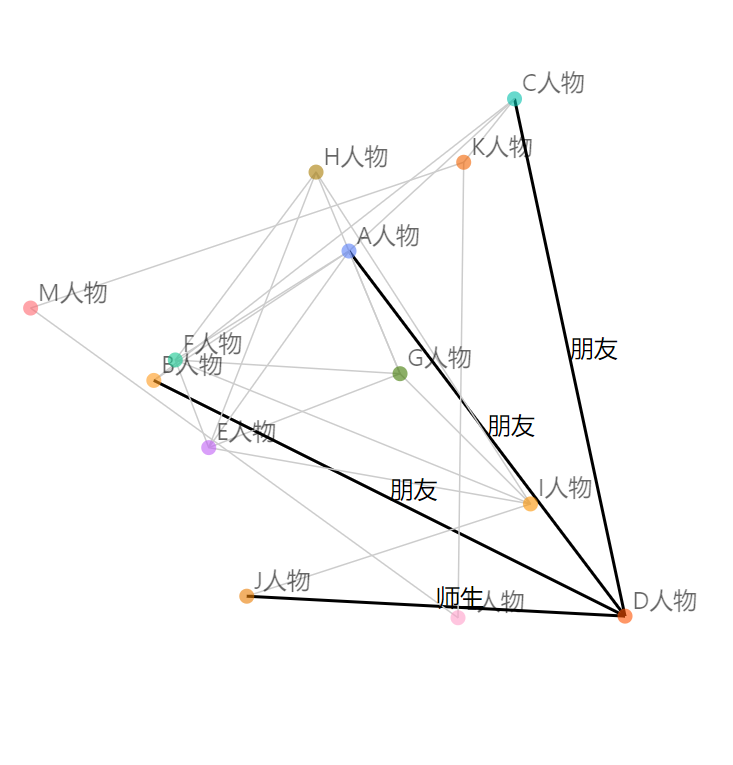
- 简单标签云图
  

# 参考
[样例参考地址](http://www.a4z.cn/pui/ant-admin.html#/simple-bar-chart)